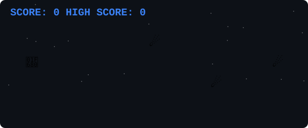

  

  <em>I am not chasing passion blindly. I seek the highest ROI on my time, effort, and intelligence.</em>

---

### 🚀 About Me

My success is built on a strategic mission towards global impact. I don’t rely on fleeting motivation; my foundation is built on **strict discipline, physical/mental optimization, and continuous execution**.

- 🔭 **Current Focus:** Executing a rigorous profile-building operation for fully-funded global migration routes (e.g., MEXT Japan), integrating hackathons, Olympiads, and high-ROI certifications.
- 🌍 **Impact:** Actively participating in India Vision 2050 discussions and real-world impact projects, starting with the purification of rivers in Tirupur.
- 🤝 **Affiliations:** Developer Program Member at **NVIDIA & AMD**.
- 🌱 **Mentorship:** Guiding my younger brother towards global competition, exposure, and elite comprehension.

### 🧠 Core Philosophy
1. **Maximum Leverage:** Seeking world-class impact through technology.
2. **Discipline > Motivation:** Rebuilding from the root with consistent mental and physical routines.

---

### 💻 Technical Arsenal

#### Core Programming & Development

  
  
  
  
  
  
  

#### Emerging Tech & Architecture

  
  
  
  
  

#### Tools & Platforms

  
  
  
  

---

### 📊 GitHub Stats

  
  

 

  

---

### 📫 Connect with Me

  
  
  

---

  
<em>"I am intentional, not loud, and my ultimate vision is to reach a world-class level of impact."</em>

  

---

### 🚀 Play My Space Flight Mini-Game!

*Click a link below to open an issue. GitHub Actions will process your move and update the board!*

  
    
  <a href="https://github.com/Prithic/Prithic/issues/new?title=space-game%7Cup&body=Press+Submit+new+issue+to+move+the+ship+up!">⬆️ Move Up</a> • 
  <a href="https://github.com/Prithic/Prithic/issues/new?title=space-game%7Cshoot&body=Press+Submit+new+issue+to+fire+your+laser!">🎯 Shoot</a> • 
  <a href="https://github.com/Prithic/Prithic/issues/new?title=space-game%7Cdown&body=Press+Submit+new+issue+to+move+the+ship+down!">⬇️ Move Down</a>

