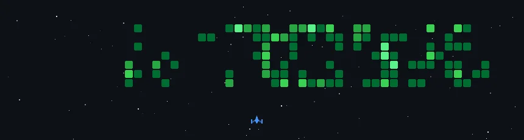

  
  
  <h1>AIML Engineer | Systems Architect | Future Founder</h1>
  
  

    <em>"Translating complex algorithms into real-world impact through intentional engineering and radical discipline."</em>
  

  

    
    
    
  

---

### 🧠 The Mission

I don't just write code; I architect solutions for maximum leverage. My work sits at the intersection of **Artificial Intelligence** and **Global Resource Optimization**. Currently executing a rigorous operation to bridge the gap between academic research and deployable, real-world systems.

- 🔭 **Current Operation:** Engineering high-ROI systems for global migration routes (MEXT Japan) and hackathon dominance.
- ⚡ **Core Philosophy:** Rebuilding from the root. Discipline is the engine; AI is the fuel.
- 🌍 **Impact:** Actively contributing to India Vision 2050 and local environmental restoration (Tirupur River Purification).

---

### 🛠️ Technical Arsenal

  <h3>Languages & Scripting</h3>
  
  
  
  
  
  
  
  
  
  

  <h3>Artificial Intelligence & Data Intelligence</h3>
  
  
  
  
  
  
  
  

  <h3>Advanced Frameworks & Web Ecosystem</h3>
  
  
  
  
  
  
  
  
  
  

  <h3>Data Systems & Archiving</h3>
  
  
  
  
  
  
  
  
  

  <h3>Infrastructure & Systems Architecture</h3>
  
  
  
  
  
  
  
  
  
  
  

---

### 🚀 High-Impact Projects

#### 🛡️ ApexGuardian (In Development)
*   **The Problem:** Fragmented security monitoring in complex distributed environments.
*   **The Solution:** An AI-driven sentinel system that predicts vulnerabilities before they are exploited.
*   **Tech:** Python, TensorFlow, Docker, AWS.

#### 🔄 ScholarSync
*   **The Problem:** Global talent is often disconnected from high-leverage funding (MEXT, Fulbright).
*   **The Solution:** An intelligent matching engine that optimizes candidate profiles for specific global migration routes.
*   **Tech:** Next.js, FastAPI, PostgreSQL.

#### 🏛️ CivicShield AI
*   **The Problem:** Lagging response times in municipal water quality and disease trend reporting.
*   **The Solution:** Predictive analysis dashboard used for monitoring Tirupur river contamination levels in real-time.
*   **Tech:** React, Python, Machine Learning, Map APIs.

---

### 🌐 Connect Me

  
  
  
  
  
  
  
   
  
  
  
  
   
  
  
  

---

### 📊 Performance Metrics

  <table border="0">
    <tr>
      <td>
        
      </td>
      <td>
        
      </td>
    </tr>
    <tr>
      <td colspan="2" align="center">
        
      </td>
    </tr>
  </table>

---

### 🕹️ The Arena

  <em>The contribution graph is a battlefield. Every commit is a tactical move.</em>

  

  

